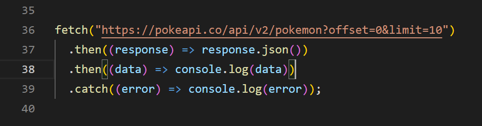

# O que é API?

A sigla API deriva da expressão inglesa Application Programming Interface que, traduzida para o português, pode ser compreendida como uma interface de programação de aplicação. Ou seja, API é um conjunto de normas que possibilita a comunicação entre plataformas por meio de uma série de padrões e protocolos.

Por meio de APIs, desenvolvedores podem criar novos softwares e aplicativos capazes de se comunicar com outras plataformas. Por exemplo: caso um desenvolvedor queira criar um aplicativo de fotos para Android, ele poderá ter acesso à câmera do celular através da API do sistema operacional, sem ter a necessidade de criar uma nova interface de câmera do zero.

Um outro exemplo, o sistema de software do instituto meteorológico contém dados meteorológicos diários. A aplicação para a previsão do tempo em seu telefone “fala” com esse sistema por meio de APIs e mostra atualizações meteorológicas diárias no telefone.

## Qual a função de uma API?

A função de uma API é, basicamente, facilitar e simplificar o trabalho de desenvolvedores, além de oferecer um padrão para a criação de novas plataformas. Com o uso das APIs, não é necessário criar códigos personalizados para cada função que um programa for executar, o que simplifica a criação de novos aplicativos, softwares e plataformas em geral.

Além disso, as APIs também possuem papel fundamental quando o assunto é segurança, já que também são capazes de bloquear acesso e permissões a dados de software e hardware que algumas aplicações não podem usar.

# O que é requisiçao?

É o pedido que um cliente realiza a nosso servidor. Esse pedido contém uma série de dados que são usados para descrever exatamente o que o cliente precisa. Vamos pensar que um cliente precisa cadastrar um novo produto, ele deve passar todos os dados necessários para o cadastro acontecer de maneira correta, inclusive os dados que foram digitados pelo usuário em um formulário, no caso de uma aplicação web. No navegador toda vez que trocamos de página ou apertamos enter na barra de endereço uma nova request é feita. Independente se estamos apenas pedindo a exibição de uma página, cadastrando um novo recurso, atualizando ou excluindo.
## Como funciona a requisição para uma API
Você irá precisar realizar uma requisição para uma API, quando precisar consumir dados de um backend, informações que ficam hospedadas em um servidor e entre outros.

Normalmente essas informações são tratadas e servidas por linguagens de programação de backend como PHP, Java, Phyton e entre outras.

Se você é um programador frontend, provavelmente irá precisar realizar requisições para buscar dados em um backend.

Normalmente os dados que precisar acessar estarão disponíveis em uma URL, por exemplo www.sitedaempresa.com.br/usuarios, esse é um exemplo de URL para buscar dados de usuários.

Essa URL poderia retornar um JSON com todos os usuários cadastrados no sistema, e a partir disso você pode listar todos esses dados em uma tabela.

# O que sao funçoes assincronas?

No dia-a-dia do desenvolvimento web, utilizamos muito (e cada vez mais) dados externos - por exemplo, recebidos através de um endpoint de uma API REST (um microserviço) ou resultados de algum outro processamento. Ou seja, quando isso ocorre o sistema tem que esperar os dados "chegarem" antes de executar a ação seguinte.

Costumamos chamar de programação assíncrona o ato de executar uma tarefa em "segundo plano", sem nosso controle direto disso. Sem explicitamente trabalhar com threads e coordená-las. Escrevendo basicamente da forma tradicional que temos. Porém, é importante frisar o comportamento do JavaScript de "executar uma coisa por vez". Com isso em mente o assíncrono no JavaScript vai separar seu código em duas partes: coisas que rodam agora, coisas que vão rodar depois de algo acontecer.

# O que é Fetch?
O Fetch API é uma interface JavaScript moderna para fazer requisições HTTP/HTTPS de forma assíncrona. Essa API permite que os desenvolvedores criem aplicações web mais interativas e dinâmicas, oferecendo uma maneira mais intuitiva e fácil de realizar chamadas de rede.

Antes do surgimento do Fetch API, os desenvolvedores costumavam usar a XMLHttpRequest (XHR) para fazer requisições AJAX (Asynchronous JavaScript and XML), que permitiam carregar dados do servidor em segundo plano sem atualizar a página. No entanto, a XHR tinha algumas limitações, como a falta de suporte nativo para promessas e a necessidade de manipular manualmente o estado de carregamento da requisição.

A Fetch API resolve esses problemas oferecendo uma API mais simples e limpa para fazer requisições assíncronas. Além disso, a Fetch API fornece suporte para promessas, o que significa que os desenvolvedores podem usar o método then() para manipular a resposta da requisição e o método catch() para lidar com erros.

A API Fetch oferece uma variedade de métodos para personalizar uma requisição, como headers personalizados, tipos de dados, autenticação, entre outros. Por exemplo, um desenvolvedor pode usar o método fetch() para solicitar um arquivo JSON do servidor e, em seguida, usar o método then() para manipular os dados recebidos.

Nesse exemplo, é possível ver como a função fetch() é utilizada para fazer uma solicitação GET para a API pública de Pokémon (https://pokeapi.co/). Mais especificamente, a requisição busca informações sobre os primeiros 10 pokémons, definidos pelos parâmetros "offset" e "limit" na URL.

Assim que a requisição é concluída, a resposta é convertida em um objeto JavaScript usando o método json(), o que permite que os dados sejam manipulados no código da aplicação. Por fim, os dados são exibidos no console, permitindo que o desenvolvedor possa analisar a resposta da requisição e utilizar as informações obtidas em sua aplicação.

A Fetch API também permite que os desenvolvedores usem diferentes tipos de requisições HTTP, como GET, POST, PUT e DELETE. Além disso, a API oferece suporte a CORS (Cross-Origin Resource Sharing), o que significa que os desenvolvedores podem fazer solicitações entre domínios diferentes com segurança.

Em resumo, o Fetch API é uma interface moderna e intuitiva para fazer requisições HTTP/HTTPS em aplicações web. Ele oferece suporte a promessas, personalização de requisições e suporte a CORS, tornando mais fácil e eficiente para os desenvolvedores trabalharem com chamadas de rede em suas aplicações.

# O que é Promise?

É para esse tipo de situação, que requer processamento assíncrono que existem as Promises, ou, literalmente, promessas. O sentido de Promise em JavaScript é similar ao literal: Uma pessoa te passa o contato do Telegram e pede para que você mande uma mensagem pra ela, prometendo que vai responder... O que não temos como saber se vai acontecer.

Quando enviamos uma requisição de dados a uma API, temos uma promessa de que estes dados irão chegar, mas enquanto isso não acontece, o sistema deve continuar rodando. Se, por exemplo, o servidor estiver caído, essa promessa de dados pode não se cumprir, e temos que lidar com isso. As Promises trabalham neste contexto - elas são a ferramenta que o JavaScript utiliza para lidar com código assíncrono.

## E como funcionam as Promises?

Promises têm um método chamado .then(), que recebe uma função callback e retorna um "objeto-promessa". Não é um retorno dos dados, é a promessa do retorno destes dados.

Assim, podemos escrever o código do que irá acontecer em seguida, com os dados recebidos pela Promise, e o JavaScript vai aguardar a resolução da Promise sem pausar o fluxo do programa.

O resultado pode ou não estar pronto ainda, e não há forma de pegar o valor de uma Promise de modo síncrono; Só é possível requisitar à Promise que execute uma função quando o resultado estiver disponível - seja ele o que foi solicitado (os dados da API, por exemplo), ou uma mensagem de erro caso algo tenha dado errado com a requisição (o servidor pode estar fora do ar, por exemplo).
